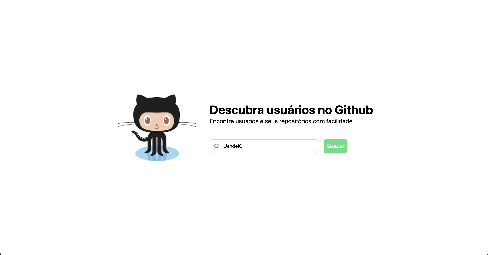

# Teste para vaga de front-end na Gendo.com.br
Este repositório é o teste para vaga de front-end developer na empresa [Gendo](https://gendo.com.br).

## Instruções

obs.: É aconselhável que você esteja usando o Node.js na versão 20.12.1 e o npm na versão 10.5.0.

1. Clone o repositório
```bash
git clone https://github.com/UendelC/gendo-frontend-test.git
```

2. Instale as dependências
```bash
npm install
```

3. Inicie o servidor de desenvolvimento
```bash
npm run dev
```

4. Abra o navegador e acesse o endereço `http://localhost:5173`

5. Digite o nome de um usuário do GitHub no campo de busca e clique no botão "Buscar"



## Usando dados mockados

crie um arquivo `.env` na raiz do projeto:
```bash
cp .env.example .env
```

e adicione a seguinte variável de ambiente:
```bash
VITE_MOCKED=true
```

## Tecnologias utilizadas
- [Vue.js](https://vuejs.org/)
- [Vite](https://vitejs.dev/)
- [Tailwind CSS](https://tailwindcss.com/)
- [GitHub API](https://docs.github.com/en/rest)
